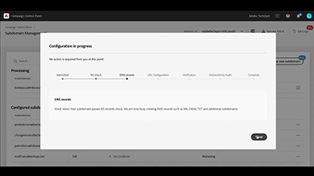

# Overzicht van het Configuratiescherm

Met het Adobe Campaign Configuratiescherm kunnen Adobe Campaign-beheerders belangrijke assets controleren en beheertaken uitvoeren, zoals het beheren van de SFTP-opslag per instantie, het beheren van GPG-sleutels of subdomeinen en certificaten.

## Nieuwe functies

* **[Configuratiescherm voor hybride hostingmodellen](/help/control-panel-for-hybrid-hosting-models.md)**

   *Leer hoe u het configuratiescherm inschakelt voor hybride hostingmodellen van Adobe Campaign, toegang krijgt tot het configuratiescherm en de belangrijkste functies ontgrendelt.*

* **[Workflows bewaken](/help/performance-monitoring/monitor-workflows.md)**

   *Leer hoe u het tijdelijke opslaggebruik van uw workflows kunt bewaken en waar u workflowinstellingen kunt configureren om database- of workflowproblemen op uw instantie te voorkomen.*

* **[Doorvoer en latentie bewaken](/help/performance-monitoring/monitor-throughputs-and-latency.md)**

   *Leer hoe u de leveringsdoorvoer en transactieberichtlatenties van uw Campaign-instantie kunt bewaken.*

Zie [Aanvullende informatie](https://experienceleague.adobe.com/docs/control-panel/using/release-notes.html?lang=nl) voor meer informatie over de nieuwste productreleases.

## Aanbevolen door medewerkers

<table>
<tr>
  <td>
    
    

      <a href="./subdomains-and-certificates/subdomain-delegation.md">
    <strong>Subdomeinen delegeren naar Adobe Campaign (video)</strong>
    </a>
    

    

    <em>Ontdek hoe u een subdomein volledig kunt delegeren aan Adobe Campaign.</em>
    

  </td>
   <td>
    
    

    <a href="./subdomains-and-certificates/google-txt-record-management.md">
    <strong>Google TXT-recordbeheer (video’s)</strong>
    </a>
    

    

    <em> Leer hoe u via het Configuratiescherm van Campaign Google-TXT-records voor websiteverificatie toevoegt aan al uw subdomeinen die worden gebruikt om e-mails naar GMAIL-adressen te verzenden.</em>
    

  </td>
  <td>
    
    

      <a href="./sftp-management/connect-to-sftp-server.md">
    <strong>Verbinding maken met een SFTP-server</strong>
    </a>
    

    

    <em>Ontdek hoe u verbinding maakt met uw SFTP-server met behulp van een client-SFTP-applicatie. Hierbij worden de sleutels gebruikt die u in het Configuratiescherm hebt opgeslagen. </em>
    

  </td>
</tr>
</table>

## Aanvullende bronnen

* [Help Center voor het Configuratiescherm](https://experienceleague.adobe.com/docs/control-panel/using/control-panel-home.html?lang=nl)
